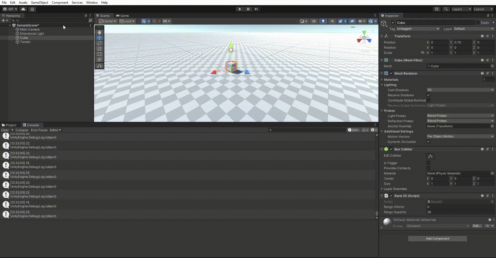
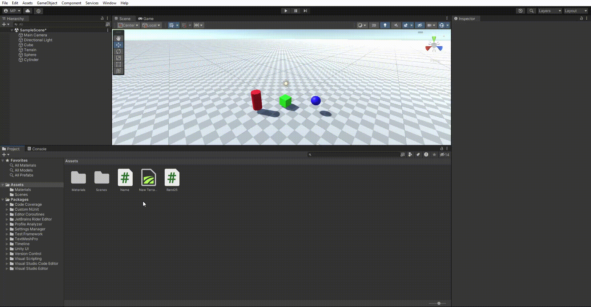
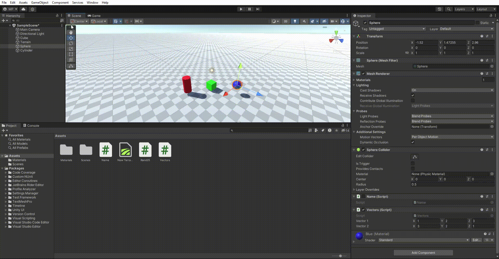
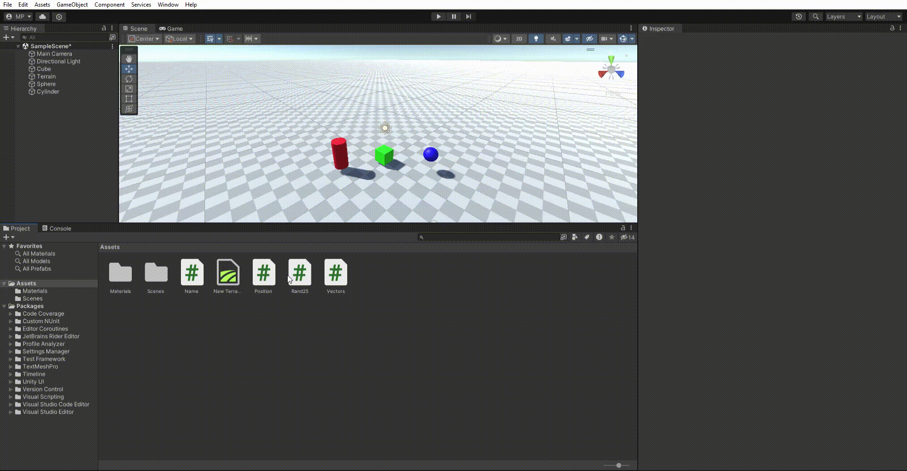
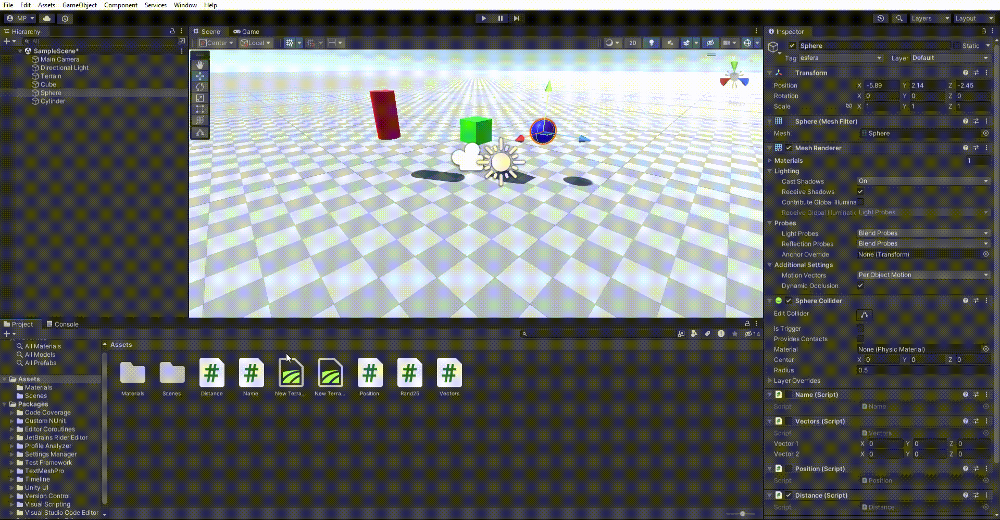
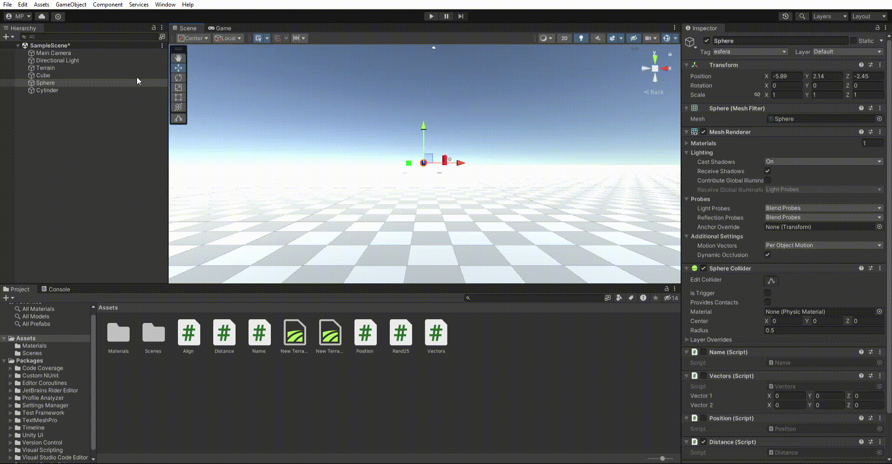
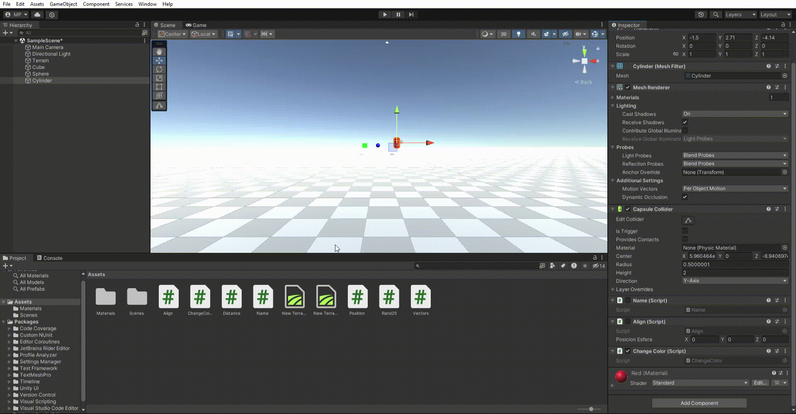
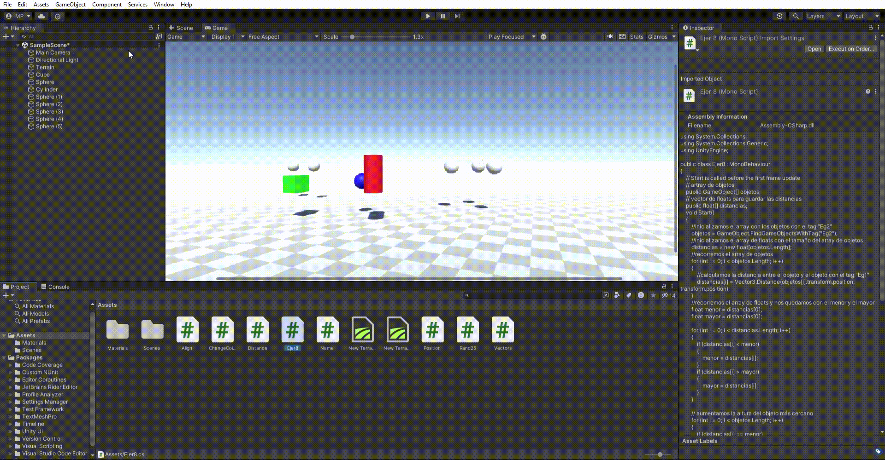

# Interfaces-Inteligentes-P02
Ejercicios de la práctica 2 de la asignatura de Interfaces Inteligentes

## Ejercicio 1
### Descripción
Crea un script asociado al cubo que inicialice un array a un conjunto de valores
numéricos aleatorios entre 0 y 25. En cada frame se debe cambiar una posición
aleatoria y mostrar en pantalla en la consola los que sean mayores que 15.
Parametrizar el rango para poderlo cambiar desde el inspector.

### Resultado

Enlace script: [Ejercicio 1](Scripts/1.cs)

## Ejercicio 2
### Descripción
Crea una escena simple en la que ubiques un plano y sobre él un cubo, una esfera y
un cilindro. Cada uno de los objetos debe estar en un color diferente. En la consola
cada objeto debe mostrar su nombre.

### Resultado

Enlace script: [Ejercicio 2](Scripts/2.cs)

## Ejercicio 3
### Descripción
Crea un script asociado a la esfera con dos variables Vector3 públicas. Dale valor a
cada componente de los vectores desde el inspector. Muestra en la consola:
	a. La magnitud de cada uno de ellos.
	b. El ángulo que forman
	c. La distancia entre ambos.
	d. Un mensaje indicando qué vector está a una altura mayor.

### Resultado

Enlace script: [Ejercicio 3](Scripts/3.cs)

## Ejercicio 4
### Descripción
Muestra en pantalla el vector con la posición de la esfera.

### Resultado

Enlace script: [Ejercicio 4](Scripts/4.cs)

## Ejercicio 5
### Descripción
Crea un script para la esfera que muestre en consola la distancia a la que están el
cubo y el cilindro.

### Resultado

Enlace script: [Ejercicio 5](Scripts/5.cs)

## Ejercicio 6
### Descripción
Crea un script que alinee el cilindro y el cubo con la esfera, 5 unidades a derecha e
izquierda respectivamente en el eje X. Prueba a cambiar a cambiar la coordenada x
de la posición de la esfera en el Inspector de Objetos.

### Resultado

Enlace script: [Ejercicio 6](Scripts/6.cs)

## Ejercicio 7
### Descripción
Cambia el color del cilindro cuando el usuario pulse la tecla A, cambia el color del
cubo cuando el usuario pulse la flecha arriba.

### Resultado

Enlace script: [Ejercicio 7](Scripts/7.cs)

## Ejercicio 8
### Descripción
Agrega 5 esferas más en la escena. Crea un grupo de 2 , asígnales la misma
etiqueta y a las restantes otra etiqueta diferente a ésta. Crea un vector con las
distancias de cada una de las del segundo grupo al cubo. Sube en altura (aumenta
la y) de la esfera más cercana. Cambiar color de la más lejana cuando el jugador
pulsa la tecla espacio.

### Resultado

Enlace script: [Ejercicio 8](Scripts/8.cs)ç